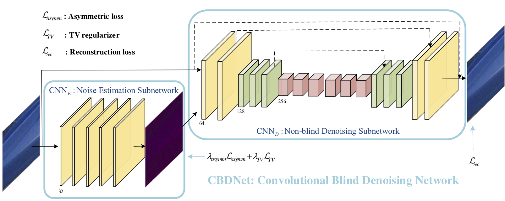

# CBDNet-tensorflow 

An unofficial implementation of CBDNet by Tensorflow.

[CBDNet in MATLAB](https://github.com/GuoShi28/CBDNet)

## Network Structure



## Realistic Noise Model
Given a clean image `x`, the realistic noise model can be represented as:

)))

=n_s(\\textbf{L})+n_c)

Where `y` is the noisy image, `f(.)` is the CRF function and the irradiance ) , `M(.)` represents the function that convert sRGB image to Bayer image and `DM(.)` represents the demosaicing function.

If considering denosing on compressed images, 

))))

# Result


# Quick Start

Use followed command to train the model:

```
python train.py
```

Use followed command to test the pretrained model:

```
python test.py
```